# Batteship
## Execute project:
- Server: `./gradlew :server:run --console=plain`
- Client: `./gradlew :client:run --console=plain --args=<player name>`

## Klassendiagramm (beinhaltet nicht alle Klassen in org.shared)

```mermaid
classDiagram
    namespace org.server.errorhandling {
        class Result["sealed interface Result (T, R)"] {
            +ok(value: T) Result.Ok(T, R)$
            +error(error: R) Result.Error(T, R)$

            +isError() boolean
            +isOk() boolean

            +then(f: fn(T) -> Result(S, R)) Result(S, R)
            +mapOk(f: fn(T) -> S) Result(S, R)
        }
        class Ok ["record Result.Ok(T, R)"] {
            value: T
        }
        class Error ["record Result.Error(T, R)"] {
            error: R
        }

        class ServerError["sealed interface ServerError"]

        class ServerError.InitError["record ServerError.InitError"] {
            exception: Exception
        }
        class ServerError.IOError["record ServerError.IOError"] {
            exception: IOException
        }
        class ServerError.ClientConnectError["record ServerError.ClientConnectError"] {
            exception: IOException
        }
        class ServerError.ClientPropertyError["record ServerError.ClientPropertyError"] {
            msg: String
        }
        class ServerError.InvalidHandshakeError["record ServerError.InvalidHandshakeError"]
        class ServerError.InvalidMoveReceived ["record ServerError.InvalidMoveReceived"] {
            exception: IllegalArgumentException
        }
    }

    ServerError <|-- ServerError.InitError
    ServerError <|-- ServerError.IOError
    ServerError <|-- ServerError.ClientConnectError
    ServerError <|-- ServerError.ClientPropertyError
    ServerError <|-- ServerError.InvalidHandshakeError
    ServerError <|-- ServerError.InvalidMoveReceived
    
    namespace org.server {
        class ServerMain["Main"] {
            main(args: String[])
        }

        class GameServer {
            -socket: ServerSocket
            -player1: Player
            -player2: Player

            +start()
            -startGame() Result(Void, ServerError)
            -handleAttack(attacker: Player, dender: Player) Result(Void, ServerError)
            -handleGameEnd(winner: Player, loser: Player) Result(Void, ServerError)

            -initialize() Result(Void, ServerError)
            -connectPlayers() Result(Void, ServerError)
            -disconnectPlayers() Result(Void, ServerError)

            -close() throws IOException
        }

        class Player {
            -name:      String
            -socket:    Socket
            -reader:    BufferedReader
            -writer:    PrintWriter
            -shipBoard: ShipBoard

            -Player(socket: Socket) throws IOException
            -doHandshake() Result(Void, ServerError)
            -connect() Result(Void, ServerError)
            -readPlayerInfo() Result(Void, ServerError)

            +getMove() Result<Move, ServerError>
            +hasLost() boolean
            +sendBoardUpdate(m: Move) Result(Boolean, ServerError)
            +sendResponse(isHit: boolean)
            +sendAwaitMove()
            +sendDefeat()
            +sendWin()

            +fromSocket(socket: Socket) Result(Player, ServerError)
            +run()
            +close() throws IOException
        }
    }



    namespace org.client.errorhandling {
        class ClientError ["sealed interface ClientError"] {}

        class InitError ["record ClientError.InitError"] {
            e: IOException
        }
        class ServerConnectError ["record ClientError.ServerConnectError"] {
            e: IOException
        }
        class InvalidHandshakeError ["record ClientError.InvalidHandshakeError"]
        class UnknownInstructionError ["record ClientError.UnknownInstructionError"]
        class UserIOError ["record ClientError.UserIOError"]
        class IOError ["record ClientError.IOError"]
        class LostConnectionError ["record ClientError.LostConnectionError"]

        class ClientException {
            error: ClientError
            +ClientException(error: ClientError)
            +of(error: ClientError) ClientException$
        }
    }


    namespace org.client {
        class ClientMain["Main"] {
            main(args: String[])
        }

        class Marker["enum MarkerBoard.Marker"] {
            None,
            Miss,
            Hit
        }
        class MarkerBoard {
            -board: MarkerBoard.Marker[][]

            +MarkerBoard()
            +placeMarker(x, y: int, marker: MarkerBoard.Marker)
            +toString() String
        }

        class GameClient {
            -socket: Socket
            -reader: BufferedReader
            -writer: PrintWriter
            -scanner: Scanner
            -markerBoard: MarkerBoard
            
            +GameClient(name: String)
            +start(scanner: Scanner) throws ClientException
            -gameLoop() throws ClientException
            -handleDefeat()
            -handleAwaitMove()
            -handleWin()
            -handleSendMove() throws ClientException
            -receiveMoveResult() boolean throws ClientException
            -handleUpdateBoard() throws ClientException

            -promptMove() Move
            -readLineOrThrow() throws ClientException

            -connectToServer(board: ShipBoard) throws ClientException
            -disconnectFromServer() throws ClientException
            -performHandshake() throws ClientException
            
            +close() throws IOException
        }
    }

    namespace org.shared {
        class Move {
            x: int
            y: int
        }
        class ShipBoard {
            -ships: Ship[]

            -ShipBoard()

            +fromArray(Ship[] ships) throws IllegalArgumentException$
            +fromUserInput(scanner: Scanner)
            +registerHit(x, y: int) boolean
            +hasShipAt(x, y: int) boolean
            +getShipAt(x, y: int) Ship
            +hasAliveShips() boolean

            +encode() String
            +decode(encoded: String) throws IllegalArgumentException$

            +toString() String

            -hasShipAt(ships: Ship[], x, y: int) boolean$
            -hasOverlap(ships: Ship[], x, y, length: int, o: Ship.Orientation)$
            -hasOverlap(ships: Ship[], x, y, length: int, o: Ship.Orientation)$
            -isWithinBounds(Ship ship)$
            -isWithinBounds(x, y, length: int, o: Ship.Orientation)$
            -isValidShipArrayOrThrow(Ship[] ships) throws IllegalArgumentException$
            -promptOrientation() Ship.Orientation$
        }

        class Ship {
            -x, y, length: int
            -o: Orientation
            -segments: boolean[]

            +Ship(x, y, length: int, Ship.Orientation o)
            +registerHit(x, y: int) boolean
            +isAt(x, y: int) boolean
            +isAlive(x, y: int) boolean
            +getCellAt(x, y: int) char

            +getX() int
            +getY() int
            +getLength() int
            +getOrientation() Ship.Orientation


            +encode() String
            +decode(encoded: String) Ship throws IllegalArgumentException$
        }

        class Ship.Orientation["enum Ship.Orientation"] {
            Vertical
            Horizontal

            encode() char
        }

   
    }
    ShipBoard "1" *-- "5" Ship : has
    Ship "1" *-- "1" Ship.Orientation : has

    GameServer "2" *-- "1" Player : has
    GameServer ..> Result : uses
    GameServer ..> ServerError : uses
    
    Player ..> Move : uses
    Player "1" *-- "1" ShipBoard : has
    Player ..> Result : uses
    Player ..> ServerError : uses

    ClientException "n" *-- "1" ClientError : wraps
    ClientException <|-- Exception


    MarkerBoard "1" *-- "n" Marker : has

    Ok <|-- Result
    Error <| -- Result

    ServerMain ..> GameServer : uses
    ClientMain ..> GameClient : uses

    GameClient ..> ClientException : throws
    GameClient ..> Move : uses
    GameClient "1" *.. "1" MarkerBoard : has
    GameClient ..> ShipBoard : uses

    ClientError <|-- InitError
    ClientError <|-- ServerConnectError
    ClientError <|-- InvalidHandshakeError
    ClientError <|-- UnknownInstructionError
    ClientError <|-- UserIOError
    ClientError <|-- IOError
    ClientError <|-- LostConnectionError
```

[mermaid.live link](https://mermaid.live/edit#pako:eNq1Gttu2zb0VwQhD_JmG3GaLI1QFEjTbi2QzEWcttviPLASbROWSYOUc2mXf98hKckUSSny0uohlnTuh-dGKt_DhKU4jMMkQ0K8JWjO0WpKpzSAi6IVFmuU4IDx-VBgfov5EHPO-ALRNCN0HnzXmPJSHIJLLDZZfj0NBUYZTgNCc8xnkoeGBNFVP7jsTcMbk1Zev7JldIuyDY6Dq16BPRwvNf6ehau0iNTfGMAl-jv1uqSwaIjQ4F7wlbEMIxcO0gygBc4XmEazOJjRCPQbvC5kRhMprVd7sihXaA2cTdJJE_6j7c_xMgBncpwwntpO8TixdGALR-UEl6nhOg_f0tM1vjbniYoQxcgXAAYYJLSSDz9QkpeMCj29YJ-q9wle54TROHhX3ra4o8Z23CZz3EEiIO0o8ywjmOZnjFKctJns4v0cTT5ytsY8f3hSlRqiR5eVmMfBJOdQJrq6n0L4kvQ9FBexQEvcGgAeVBVVT7K_YLf4EieY3EJ0tnI3MZ9wdpbhOcpO-XyzAtc0e77KGkNc8OrfwaAhvDvgjrtieiKoK1F9rbsY4FueznQ1xyuq5obktiDN8AIRCqsrf3zBCa8jxOeiDNHrm15rbfsDRE8cgfIaCJYscR4XcifqyUJZZ-gB81EcfFQ3XujBFmr1D5Ejnkc9W6x8K9WKqmbymZG0bzrUplF9G5_mOUqWEVI_mJdy-0GKabp93pWt1OUdTaM7AhFmcM2Y6MjUYksgDQjEw7ddTEx0fGtpYgfClIhdaG2x0kqgyBec3YnG6muHlRblhJQM9Fjf2xW0FnIS7os3jpFaSLjebGYzzHF6qV5ZeHec5AXeRxCTf1HPtrAFWb9hiKcQ4uWtY782JKpyQf22u0N7nVVFYvdF3oFCekTr-IHO2C5L--sc57IgVTSv5FON5rVFsUDinIm8cdIUkGfKjZ_WKcpxtIoDybNS6o2majNI8QD0NaMQd0S8J-D1QpoP9fQOkcIMD_QtnmGUe0FfoFC6PplxttJr7Cx5YUOZ_S0m8A11RHbMoyqd_HuVRHWtp_YqurdV87AzsBpw1UI8-Vt1amOSMMjaB9XdhjSzcTdIcxGfI9bbxBvt7DaPfaJLyu7oBypyvkmkAm1cG7B9fKHFFJNQE68thoe-nbaZTqZ54e8nbPFgendBBU25Pg0bMTM06wlk0UcugZ1ybOZDshXZa8q_puxryrcfPJhdIA4zDDDEdLMqnlRtHep7j4w_GcX9-qsLIoT1CipqS3IYgpzu_VU3S1eX65vrG6eUGmhONYTJMMEaIbrvBw-xrE59cBJXc5srwWaQM-1FqKierZhvyD1zFq8-5LaNG51mjZZBI0F6cpzoGwu82lpbM72OZjlga1Kkhyrthp53xLYVqNqQlQuWYnNgfM7YOuqIr8dlf88tR_Smdl3Ai67sgUygZxfjSidluN5n6S2X6tzV1LKLNXqSKaK4kdDe-MAUsS6HK_njiatzQvGYX0mG3RkX8-EV0x0x-mqNrx19s90S_C7nHc2rIy3sl2eMr8zptgvdM8chzy55gSAj3WIs3W1n-b2qL_V3D9Y7dzopnerWDIAI7XW37g0quobx8pRz9BBp4kCx2rqh4bhlz8NG9X263niy2x5H8ZwIqEpQ-LfFtmmEhxFfqnbaARX2Dy6qfOOyPM0gFSVItBxEYyrP7D0VXUFTrKAaKa3qXQfXPd06nMwvfVBb6X7gumTPJR1DMmVo7aPtBxmm83xRtDumocMxl4mDpLq9n86QiC8kXxD6hm0gg1Ucqih8CvF_i_ssB2jlTxn4Zcl7TvwX9dUQG_UcTfbaj_Sl2XZeOyZacLDXEGAXBTyXOotqt-oZiaRUnyNt3QP2rBwm4rQblszKTnl-hrOszjOB8us7UfgLlsLxnAT83QQ4V55ogrYv8vRHVREVD92jsCGiTNXKyd1R2Z3bP2OekwRl1pzOOPnGgCqzbaxM1ItgK1W1TXWMVnWxaTiahsEvgwHcHcGdMjkOoMBsMWtIowKpFpkFgSYxDo-n4UGNsDgANPgbyMNh-ZUREDYC-zHME3UTTf8tBEhE1fJNjALmM0b7wlDL4ONRyYD61NFI9tZ2GtKaXPM8Jg7uOFoLP6H6blCb_jSeuSkzjZJiNKy-LuOlZqUN0u_KLxOB8d78ciH3rcpOYxVMT2w3uRVWsaWqO8MASDzbxLjIMi-ys5AGvLB7OCzuTJ9YUWZwNJfcs2TbrzXWpykH7jmCamLU-InIwW06B2rANk56GmS3Qj0nNWE_nHOShjHIx_1whfkKycdQVahpmC_wCk_DGG5TPEMyaMIpfQSyNaL_MLYqKTnbzBdhPEOZgKeN2jQV_3VRoaiPMGcwTeRhfHgyGikmYfw9vA_jo-Hx_oujo_3D0eHo5cHB4W94cNwPH8J4f7gvr5MXJ4cv9k_2R8cv948PDo8e--E3JZ5usuzxP4AfaDo)

## Sequence Diagram

### Testen
Der andere Spieler muss lange warten.

### Zusatzaufgabe (noch nicht fertig)
1. ggf. Timeout, gegenspieler kann keinen input eingeben
2. der Gegenspieler muss immer so lange warten, bis der Spieler mit seinem Zug fertig ist -> zieht das Spiel in die Länge
3. gleichzeitig könnten gleichzeitig ihren Zug platzieren, ggf. auch spannender, wenn die Züge gleichzeitig ausgeführt werden
4. 
