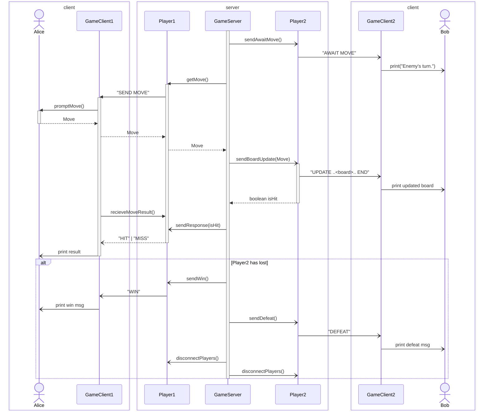

# Batteship
## Execute project:
- Server: `./gradlew :server:run --console=plain`
- Client: `./gradlew :client:run --console=plain --args=<player name>`

## Klassendiagramm (beinhaltet nicht alle Klassen in org.shared)

```mermaid
classDiagram
    namespace org.server.errorhandling {
        class Result["sealed interface Result (T, R)"] {
            +ok(value: T) Result.Ok(T, R)$
            +error(error: R) Result.Error(T, R)$

            +isError() boolean
            +isOk() boolean

            +then(f: fn(T) -> Result(S, R)) Result(S, R)
            +mapOk(f: fn(T) -> S) Result(S, R)
        }
        class Ok ["record Result.Ok(T, R)"] {
            value: T
        }
        class Error ["record Result.Error(T, R)"] {
            error: R
        }

        class ServerError["sealed interface ServerError"]

        class ServerError.InitError["record ServerError.InitError"] {
            exception: Exception
        }
        class ServerError.IOError["record ServerError.IOError"] {
            exception: IOException
        }
        class ServerError.ClientConnectError["record ServerError.ClientConnectError"] {
            exception: IOException
        }
        class ServerError.ClientPropertyError["record ServerError.ClientPropertyError"] {
            msg: String
        }
        class ServerError.InvalidHandshakeError["record ServerError.InvalidHandshakeError"]
        class ServerError.InvalidMoveReceived ["record ServerError.InvalidMoveReceived"] {
            exception: IllegalArgumentException
        }
    }

 
    namespace org.server {
        class ServerMain["Main"] {
            main(args: String[])
        }

        class GameServer {
            -socket: ServerSocket
            -player1: Player
            -player2: Player

            +start()
            -startGame() Result(Void, ServerError)
            -handleAttack(attacker: Player, dender: Player) Result(Void, ServerError)
            -handleGameEnd(winner: Player, loser: Player) Result(Void, ServerError)

            -initialize() Result(Void, ServerError)
            -connectPlayers() Result(Void, ServerError)
            -disconnectPlayers() Result(Void, ServerError)

            -close() throws IOException
        }

        class Player {
            -name:      String
            -socket:    Socket
            -reader:    BufferedReader
            -writer:    PrintWriter
            -shipBoard: ShipBoard

            -Player(socket: Socket) throws IOException
            -doHandshake() Result(Void, ServerError)
            -connect() Result(Void, ServerError)
            -readPlayerInfo() Result(Void, ServerError)

            +getMove() Result<Move, ServerError>
            +hasLost() boolean
            +sendBoardUpdate(m: Move) Result(Boolean, ServerError)
            +sendResponse(isHit: boolean)
            +sendAwaitMove()
            +sendDefeat()
            +sendWin()

            +fromSocket(socket: Socket) Result(Player, ServerError)
            +run()
            +close() throws IOException
        }
    }



    namespace org.client.errorhandling {
        class ClientError ["sealed interface ClientError"]
        class InitError ["record ClientError.InitError"] {
            e: IOException
        }
        class ServerConnectError ["record ClientError.ServerConnectError"] {
            e: IOException
        }
        class InvalidHandshakeError ["record ClientError.InvalidHandshakeError"]
        class UnknownInstructionError ["record ClientError.UnknownInstructionError"]
        class UserIOError ["record ClientError.UserIOError"]
        class IOError ["record ClientError.IOError"]
        class LostConnectionError ["record ClientError.LostConnectionError"]

        class ClientException {
            error: ClientError
            +ClientException(error: ClientError)
            +of(error: ClientError) ClientException$
        }
    }


    namespace org.client {
        class ClientMain["Main"] {
            main(args: String[])
        }

        class Marker["enum MarkerBoard.Marker"] {
            None,
            Miss,
            Hit
        }
        class MarkerBoard {
            -board: MarkerBoard.Marker[][]

            +MarkerBoard()
            +placeMarker(x, y: int, marker: MarkerBoard.Marker)
            +toString() String
        }

        class GameClient {
            -socket: Socket
            -reader: BufferedReader
            -writer: PrintWriter
            -scanner: Scanner
            -markerBoard: MarkerBoard
            
            +GameClient(name: String)
            +start(scanner: Scanner) throws ClientException
            -gameLoop() throws ClientException
            -handleDefeat()
            -handleAwaitMove()
            -handleWin()
            -handleSendMove() throws ClientException
            -receiveMoveResult() boolean throws ClientException
            -handleUpdateBoard() throws ClientException

            -promptMove() Move
            -readLineOrThrow() throws ClientException

            -connectToServer(board: ShipBoard) throws ClientException
            -disconnectFromServer() throws ClientException
            -performHandshake() throws ClientException
            
            +close() throws IOException
        }
    }

    namespace org.shared {
        class Move {
            x: int
            y: int
        }
        class ShipBoard {
            -ships: Ship[]

            -ShipBoard()

            +fromArray(Ship[] ships) throws IllegalArgumentException$
            +fromUserInput(scanner: Scanner)
            +registerHit(x, y: int) boolean
            +hasShipAt(x, y: int) boolean
            +getShipAt(x, y: int) Ship
            +hasAliveShips() boolean

            +encode() String
            +decode(encoded: String) throws IllegalArgumentException$

            +toString() String

            -hasShipAt(ships: Ship[], x, y: int) boolean$
            -hasOverlap(ships: Ship[], x, y, length: int, o: Ship.Orientation)$
            -hasOverlap(ships: Ship[], x, y, length: int, o: Ship.Orientation)$
            -isWithinBounds(Ship ship)$
            -isWithinBounds(x, y, length: int, o: Ship.Orientation)$
            -isValidShipArrayOrThrow(Ship[] ships) throws IllegalArgumentException$
            -promptOrientation() Ship.Orientation$
        }

        class Ship {
            -x, y, length: int
            -o: Orientation
            -segments: boolean[]

            +Ship(x, y, length: int, Ship.Orientation o)
            +registerHit(x, y: int) boolean
            +isAt(x, y: int) boolean
            +isAlive(x, y: int) boolean
            +getCellAt(x, y: int) char

            +getX() int
            +getY() int
            +getLength() int
            +getOrientation() Ship.Orientation


            +encode() String
            +decode(encoded: String) Ship throws IllegalArgumentException$
        }

        class Ship.Orientation["enum Ship.Orientation"] {
            Vertical
            Horizontal

            encode() char
        }

   
    }
    ShipBoard "1" *-- "5" Ship : has
    Ship "1" *-- "1" Ship.Orientation : has

    GameServer "2" *-- "1" Player : has
    GameServer ..> Result : uses
    GameServer ..> ServerError : uses
    
    Player ..> Move : uses
    Player "1" *-- "1" ShipBoard : has
    Player ..> Result : uses
    Player ..> ServerError : uses

    ClientException "n" *-- "1" ClientError : wraps
    ClientException <|-- Exception


    MarkerBoard "1" *-- "n" Marker : has

    Result <|-- Ok
    Result <| -- Error

    ServerMain ..> GameServer : uses
    ClientMain ..> GameClient : uses

    GameClient ..> ClientException : throws
    GameClient ..> Move : uses
    GameClient "1" *.. "1" MarkerBoard : has
    GameClient ..> ShipBoard : uses

    ClientError <|-- InitError
    ClientError <|-- ServerConnectError
    ClientError <|-- InvalidHandshakeError
    ClientError <|-- UnknownInstructionError
    ClientError <|-- UserIOError
    ClientError <|-- IOError
    ClientError <|-- LostConnectionError

       ServerError <|-- ServerError.InitError
    ServerError <|-- ServerError.IOError
    ServerError <|-- ServerError.ClientConnectError
    ServerError <|-- ServerError.ClientPropertyError
    ServerError <|-- ServerError.InvalidHandshakeError
    ServerError <|-- ServerError.InvalidMoveReceived
    
```

[mermaid link](https://www.mermaidchart.com/play?utm_source=mermaid_live_editor&utm_medium=toggle#pako:eNq1WUtv2zgQ_iuCkYO8dQykwF6EooCTZrcFknURp-ku4hxYibYJy6RByknTbv_7Dh-SKT5kedP6kMiab56cGQ7p74OcFXiQDfISCfGOoCVHmzlN4EPRBostynHC-HIsMH_EfIw5Z3yFaFESuky-a6T8KP7kBotdWd3PBwKjEhcJoRXmCylDU5L0dpTcDOeDB5tXfl6xdfqIyh3OktuhQY-na40_cbDKilT9zYBcwy_V65rD4SFCk4fJF8ZKjHw6aLOIDrlaYZousmRBU7Dv9K3Rmc6ktmHrm8O5QVuQbLPOYvgfbjyn6wSCyXHOeOEGJRDEOoAdElUQfKFW6AJy60i35LqSZypDlKBQAlhk0NDJPv5ASVULMnYGySFTv-Z4WxFGs-SyfuwIR0vstEvntIdGAB2p86IkmFYXjFKcd7ns436NJR8522JePR80pQUM2LIRyyyZVRzaRN_wU0hfUryH5iJWaI07EyAAVVl1UPw1e8Q3OMfkEbKzU7qNPBDsssRLVE74creB0MQjr6sm3l79hqrtukaEgq3yXyjU8DpFfCnqgN8_DDsr9U9QPfMUys-pYPkaV5nRO1PfHMi2RM-Yn2XJR_UQpL7eU51uKCrEq3ToqpVvpVlp0xrvGClG9rq4PGoXwpOqQvk6Reof5rXeUVJgWuy_HytW2nJJi_SJQMVZUksmegp1xBLoWQTS6tsxLua63rU2cQRjQcQxvK5a6SVwVCvOnkS0l7hppVV5KSUTPdPPbj9opZykh_KNY6QWEj7nu8UCc1zcqFcO7omTyuA-gprqs_ruKluR7TlDvIAUrx89_7UjaVML6n93OHTUWdORjl_kIzhkRLSNH-iCHbO0r5a4kn2t4Xkjv7V43jocKySumKiic5OAOlNh_LQtUIXTTZZImY1R55qryyElA-BbRiHviHhPIOpGWwg6eULEuBGgvsMLjKog6TM0Sj8mC842eo29JTc-1NXf4QLfUU9lzzpqyqm2rL015Gq_PTR56125me688cuiBzbKZqKytkSLo3viOm7asGeYiDYf-BK1wWEh6me_weITXVP2RD9QUfFdLg3okhpBh-TC7mImzZisPSK0jp28cT5Z4SbeB3wJIIPjvOGp1ydyorCzsl07Dn_qM7jVxhYhkGvISaz0YoUXK7WfPJNdIw7jCwjEdLcx31RbHevngI6_GMWj9qtrIoTzCpppR3FYiryN-4veJ31b7h_uH7wuasG8RghDYY41IP06Sp4z2ZhGECSuRjZfgyugYjqK0EwDZ4rQfHvhLV57vu2aNHqNGR0zRo700DjTDw55s_e25Xob5gRg71Kq5ykdhmFwunYNaHYgpxYcw5Yg-IqxbdoTryfl8HZbT-exndrQzYYcoMxguzaTSi9juD6p6UOb2rSbgeUYb_QQY7I4yuieeWCA2NZzlfwXyKsrQvGU30qB_QWb0fCW6R0x_eJMrj1jsz8N_CFHHS2rJy8c8heMb-zBtg_fCyehwAF5haAi_WYsw-1W-VfVX9rvnp13_nRSB9XvGUAROup-3ztt-CKT5YRz9Jxq5kSJ2ochcm9wEhCj9n263QWq251E8ZII6ErQ-PfNNja9w3QvTZv0gMLRwYfKN77ISQmlKEmi40YVU3n1HOjoilpgRdWgoul3PUJ3eOvwKr-OQWulR4kfkhOfdQrFVKJtiHeUlJguq5XZ7pimjqdcFg6S5g5_uUAiPpNqReg520EFqzxUWXgI-L_V3ckBWsVTJn7d8l6S_6a_WmrToWfJSffdtHTbrWvPRYcO_loK3KaAl9Jm0RxUAyOR1BoKpGt7wl5Uw0RM-qFkVfaq8wtclm2ZObTf0GXC37AUXuQk4Z8Y4UpFIkbtXuT5z-oiKh_6Z2Eko2zT6sndM9mf2-8wr0iOSmdOZ5x8Y8BVuj42LupFcI1qtk11g9bsYvPB2XyQ_HZ6Ck-_w5NyOUugweyRLdCZAbUy0zBoFuveeD543WI0d3-WfAs8Htc_lwFgJ3AYYV2utGD6r1EggWrLtxGGFnJGx8Iyy5ITMMmihszRIPdoOx_Qll77KiZLnjjaijDjm3-BpzX9aZx9KLOdkmo0rb0uxhElbrp23iVShz5gm4VvflJQflqrYEdif8htUOZI1Q6GRZA418XMVFkQ7C2kRTd-j8fmyY6Jk2WWRHvJA0umlkSFaX-hFaYHrqBigkI3RmFs7B4ogrZueiK6O6mhm5pWCnjuund9PbDTvsjAD5h9mdo_NfZxILokffhav_sprsGP_wB04iua)

## Sequence Diagram

### Testen
Der andere Spieler muss lange warten.

### Zusatzaufgabe (noch nicht fertig)
1. ggf. Timeout, gegenspieler kann keinen input eingeben
2. der Gegenspieler muss immer so lange warten, bis der Spieler mit seinem Zug fertig ist -> zieht das Spiel in die Länge
3. gleichzeitig könnten gleichzeitig ihren Zug platzieren, ggf. auch spannender, wenn die Züge gleichzeitig ausgeführt werden
4. 
